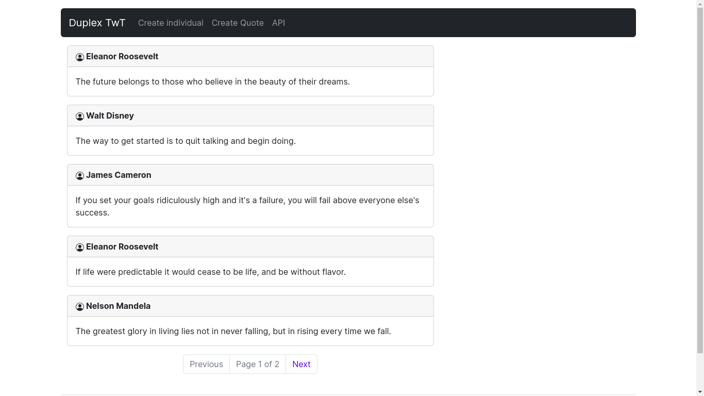
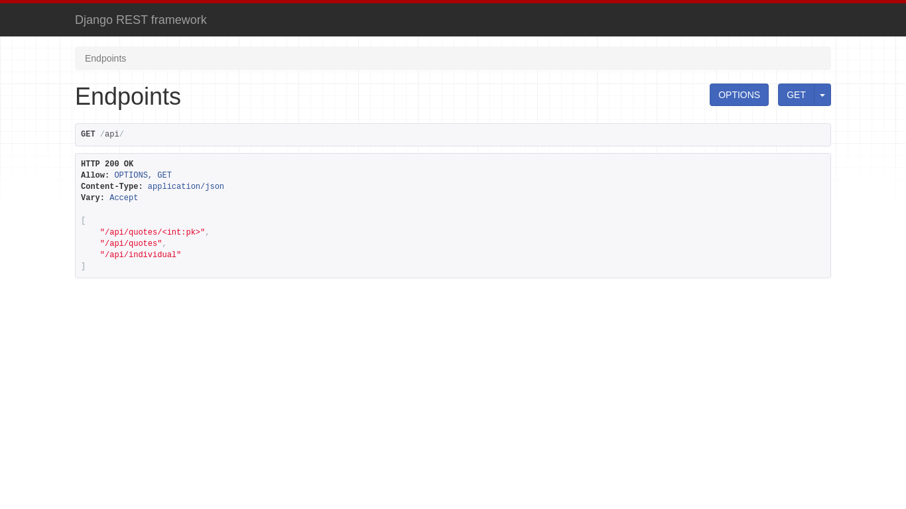
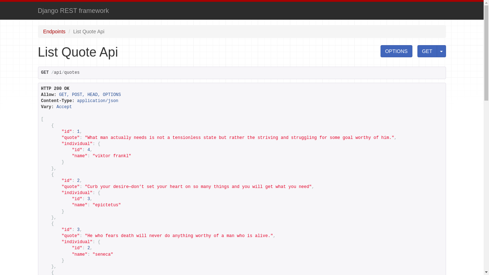

<div align="center">

# Duplex Tweet 📰️

    A restful api make with django-rest-framework.

</div>



<h3>
<details>
<summary>📖 Prerequisite</summary>

<small> - Install 🐍 [Python3](https://www.python.org/) and [PIP](https://i.redd.it/ltidkb8taff61.jpg)</small>

</details>
</h3>

## 📀 Running Demo
<h3> Steps for running the instance of projects :</h3>

```sh
git clone https://github.com/ogdhruv/duptwt.git
```
```sh
cd duptwt
```
```sh
python -m venv .venv
```
```sh
source .venv/bin/activate
```
```sh
pip install -r requirements.txt
```
```sh
python manage.py migrate
```
```sh
python manage.py runserver
```


## Features 🌟

* 🌼 Seprate UI made with Bootstrap
* 🌈 Django-rest-framework for API Development

## Tech Stack / Built With 📜️

1. 📗 [Django](https://www.djangoproject.com/)
2. 🟩 [Django REST framework](https://www.django-rest-framework.org/)
3. 🌼 [Bootstrap](https://getbootstrap.com/)

## Screenshot

* **API endpoints**



* **API list view**




## Authors 😁️
 
#### ogDhruv
 
 You can find me here at:
[Github](https://github.com/ogdhruv)


© ogDhruv